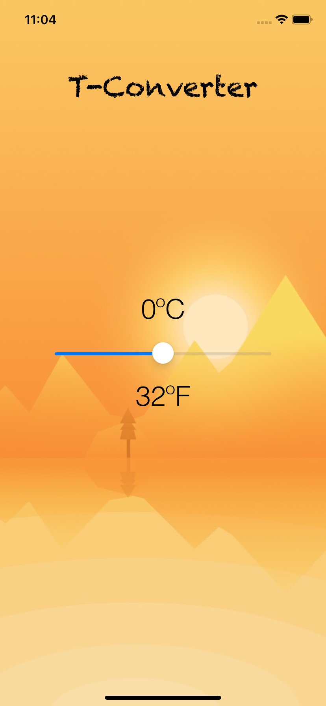
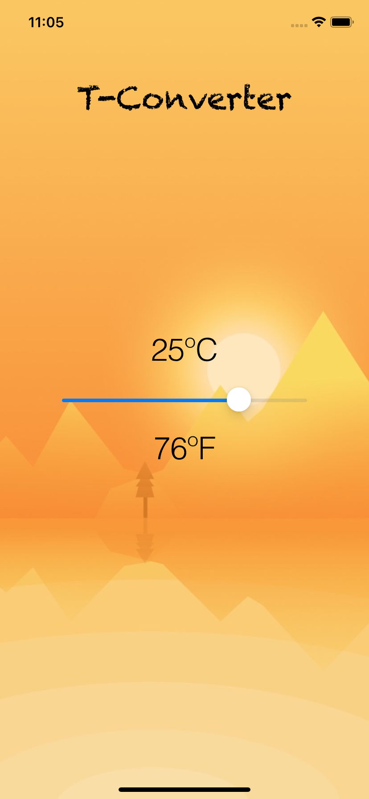
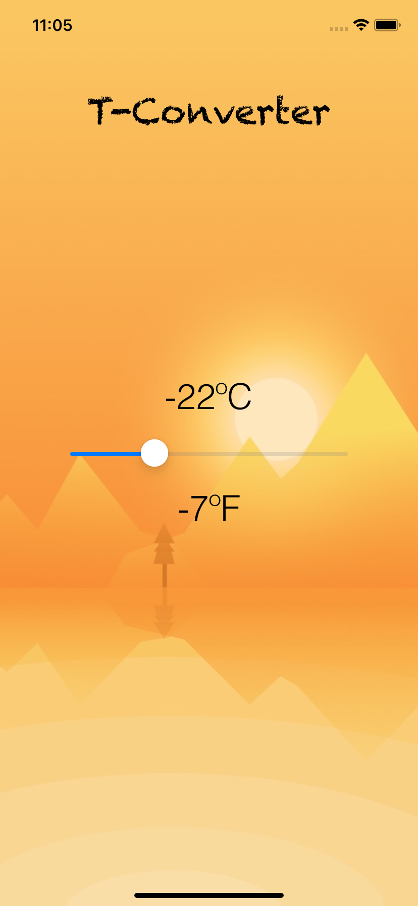

# Study Project: TConverter
A learning project as part of a Swift Book course. Applications for reading information from the slider and displaying it in Celsius temperature with subsequent translation into Fahrenheit.

# 1. Launch screen
Loading screen when launching the application.

# 2. Main screen
Three Label elements are displayed on the main screen, one of them is a field with the name of the application located at the top of the screen, the other two display temperature indicators. In the center there is a slider that changes the temperature indicators.

# 3. Interaction with the slider
When the slider moves, it transmits the value to the Celsius temperature and then the Fahrenheit temperature value is calculated using the formula.

  

    
  

  

    
